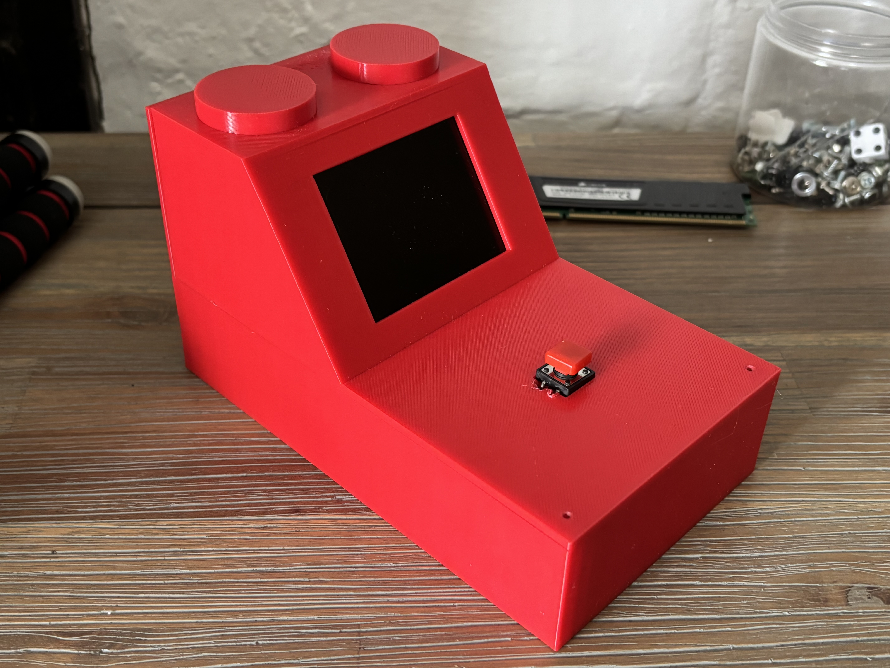

# Judgemental Reaction Speed Meter
I made a reaction speed meter that analyses your results and judges you with a message based on how good/bad you are doing!

</img>

## Demo Video

<video src="content/demo.mp4" width=400 alt="Demo Video"></video>

## Hardware
- Raspberry Pi Pico
- 320x240 2.8" LCD
- Old PC buzzer
- Breadboard
- Large Button
- 3D Printed Case - lego inspired :)

</img>
</img>

## Software
I used micropython for this project, as the code was fairly simple. It didn't require any async code, and was only one file.

The analysis works by comparing the historical average of your results, with the result you just got by calculating a ratio between them (latest / average). The lower the ratio, the bigger the improvement. If the ratio is greater than 1 then the score is worse.

The buzzer indicates when you have a high or low score. It works by generating a PWM signal at the desired frequency, and then repeating for different freqencies and times to make a tune.
